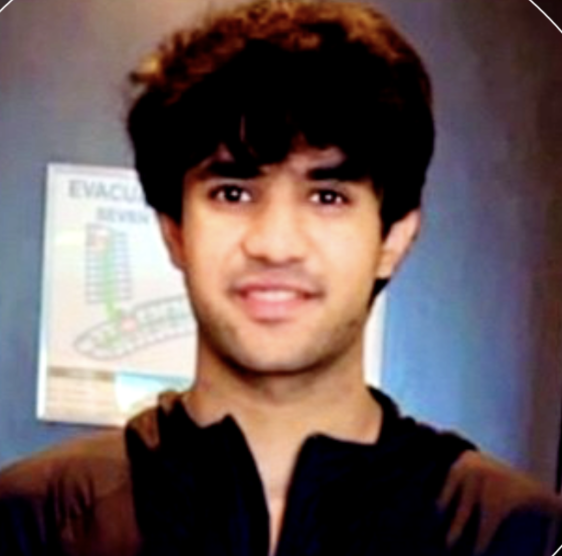

We are a team based in the [School of Computing, National University of Singapore](https://www.comp.nus.edu.sg).

## Project team

### Teng Tjin Yao

[[github](https://github.com/tjinyao)]

* Role: Project Advisor
* Responsibilities: CTO

### Rhysmond Cheng

[[github](http://github.com/Rhysmond)]

* Role: Developer
* Responsibilities: DevOps

### Muhammad Zayyan Putra Akbar

[[github](http://github.com/zayyankece)] 

* Role: Developer
* Responsibilities: Data + Product Manager

### Aryaman Bansal

[[github](http://github.com/ary-ban)]

* Role: Developer
* Responsibilities: DevOps

### Arshelle Raheja

[[github](https://github.com/Arshelle9912)]

* Role: Developer
* Responsibilities: Tech Head
