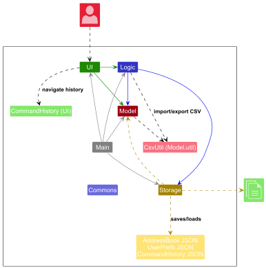
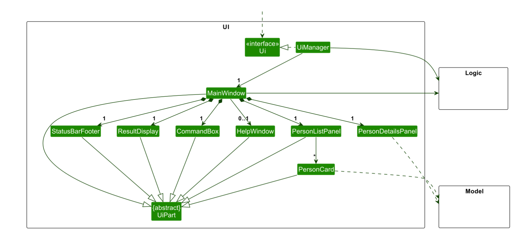
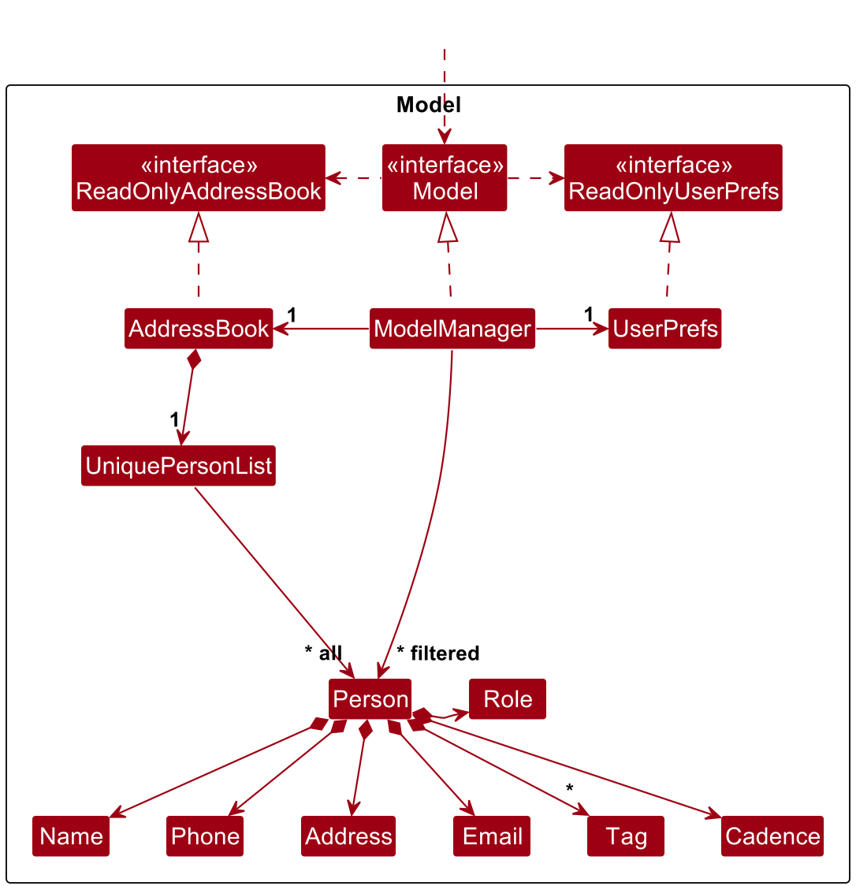
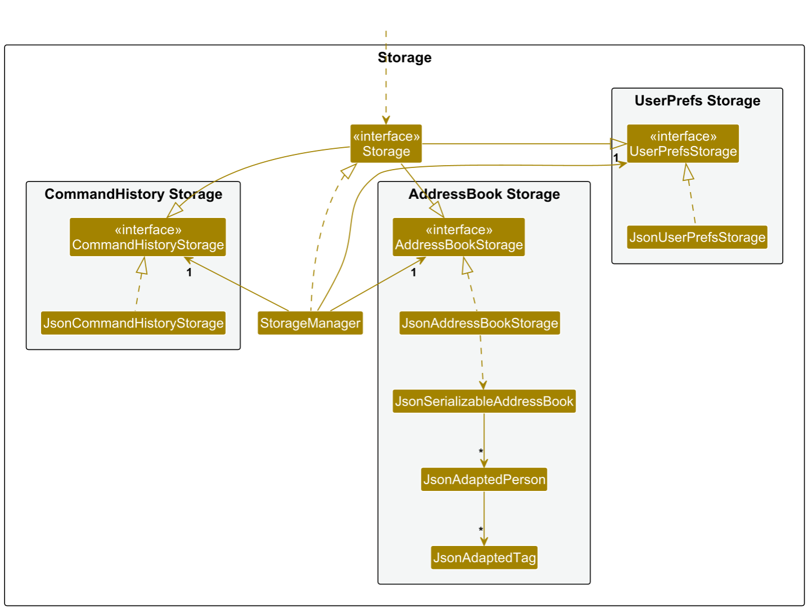
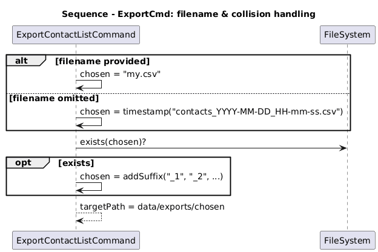
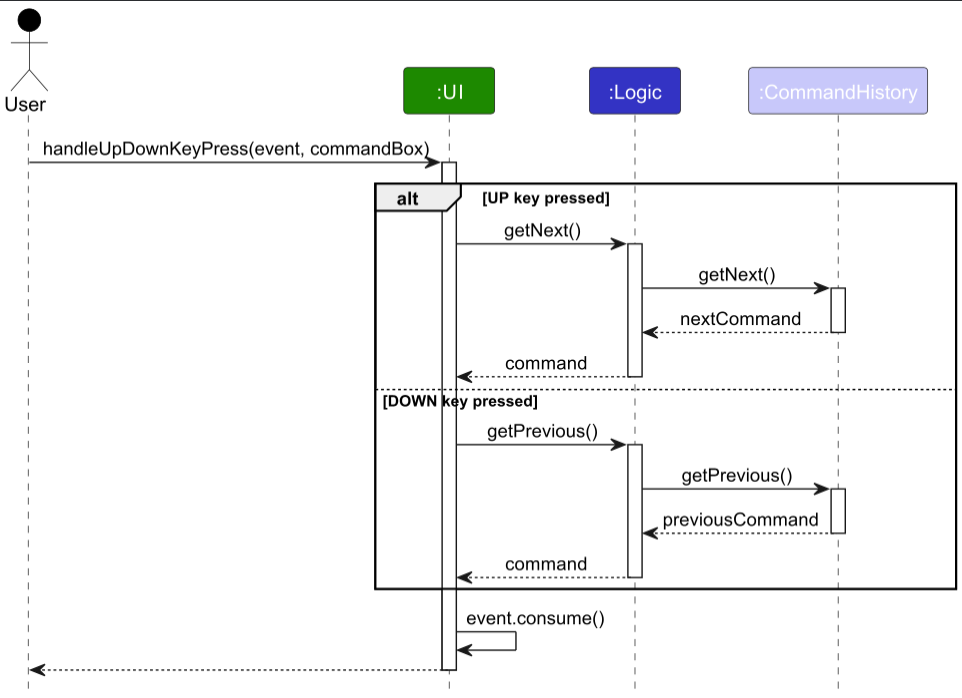

> *MeshCRM Developer Guide — built with Java 17 • Gradle • JavaFX*  
> *Base: AB3 · This document describes MeshCRM adaptations.*

## 1. Table of Contents

{: .no_toc }

* This page is auto-generated:
  {:toc}

--------------------------------------------------------------------------------------------------------------------

This guide helps new developers understand how MeshCRM works inside.  
It explains the main design ideas and how each part connects together.
It is aimed at new contributors and explains how the architecture enables the key product use cases (contact management,
interaction logging, CSV import/export).

## 2. Acknowledgements

MeshCRM is adapted from [SE-EDU AddressBook-Level3 (AB3)](https://github.com/se-edu/addressbook-level3).
We retain AB3’s architecture (UI/Logic/Model/Storage), testing/CI scaffolding (Gradle, JUnit, GitHub Actions), and
portions of its documentation structure (UG/DG).
CSV import/export is implemented in-house (`CsvUtil`) while JSON persistence continues to use Jackson.

--------------------------------------------------------------------------------------------------------------------

## 3. Setting up & Getting Started

Follow AB3’s **SettingUp** instructions (JDK 17, JavaFX, Gradle) and this repo’s `README`.
Run `gradlew clean test` to verify the build; `gradlew run` launches the app.
On first run, the app creates the `data/` folder and an initial JSON storage file.

### 3.0 Conventions Used in This Document

- **Monospace** text denotes commands, class names, methods, or code elements (e.g., `LogCommandParser`,
  `export my.csv`).
- *Figures* are captioned beneath diagrams and referenced in text where relevant.
- **Bold** highlights key terms on first introduction.
- Use cases follow the **MSS** / **Extensions** pattern.

### 3.1 Development Conventions

All new commands, parsers, and models should follow the AB3 class structure.  
Each feature should include corresponding unit tests in `src/test/java`.  
Follow the SE-EDU Checkstyle rules before committing.  
Use clear commit messages following the conventional format (`type: summary`).  
All pull requests must pass CI before merge.

--------------------------------------------------------------------------------------------------------------------

## 4. Design

> **Tip**  
> The `.puml` files used to create diagrams are in this document’s `docs/diagrams` folder. Refer to the
> [PlantUML Tutorial at se-edu/guides](https://se-education.org/guides/tutorials/plantUml.html) to learn how to create
> and edit diagrams.

### 4.1 Architecture


*Figure 1: High-level Architecture overview.*

> **Diagram scope & notation**
> Architecture diagrams in this DG intentionally stay **high-level** (components, data/control flow) and **avoid
> lower-level details** (e.g., method names, field lists). UML arrows follow AB3 conventions: **solid** for calls/data
> flow, **dashed** for return/signals, **single-headed** unless bidirectionality is essential.


The ***Architecture Diagram*** above explains the high-level design of the app.

**Changes to Architecture since AB3:**

* **Storage now also persists `CommandHistory`** (JSON at `data/commandhistory.json`) during app shutdown.
* **CSV Import/Export** uses `model.util.CsvUtil` for parsing/writing; persistent storage remains Jackson JSON.

**What MeshCRM changes vs AB3 (at a glance)**

- **Domain extensions** to `Person`: `Role` (Investor/Partner/Customer/Lead), optional `Cadence` (follow-up interval in
  days), and an immutable list of `Interaction` (type, details, timestamp).
- **New commands**: `log` (append an interaction), `sortfollowup` (sort by follow-up priority), `import` / `export` (
  CSV).
- **UI details panel** shows Role, Cadence, derived **Next follow-up** date, and an **Interactions** list.
- AB3 features like `list`, `exit`, `undo`, `find` remain with clarified semantics where applicable.

Given below is a quick overview of the main components and how they interact.

**Main components of the architecture**

**`Main`** (classes `Main` and `MainApp`) launches and shuts down the app.

* At launch, it initializes components and wires them together.
* At shutdown, it closes components and persists user data.

The bulk of the work is done by the following four components:

* [**`UI`**](#42-ui-component): JavaFX interface (views, panels, FXML).
* [**`Logic`**](#43-logic-component): Parses user input and executes commands.
* [**`Model`**](#44-model-component): In-memory state of contacts and user prefs.
* [**`Storage`**](#45-storage-component): Persists data (JSON) and provides CSV utilities (non-persistent).

[**`Commons`**](#46-common-classes) contains utilities shared across components.

**How the architecture components interact**

The *Sequence Diagram* below shows a typical flow for a mutating command (`delete 1`): UI → Logic (parse) → Command →
Model (mutate/query) → Storage/UI.


*Figure 2: Typical mutating command flow (UI → Logic → Model → Storage).*

Each component exposes an interface (`{Component}.java`) and a concrete manager (`{Component}Manager`). Other components
depend on the interface, not the concrete class, to reduce coupling.


*Figure 3: Component interfaces and managers.*

The sections below detail each component.

### 4.2 UI Component

The **API** of this component is specified in `Ui.java`.


*Figure 4: UI component structure.*

The UI uses JavaFX. `MainWindow` composes `CommandBox`, `ResultDisplay`, `PersonListPanel`, `StatusBarFooter`, and a *
*PersonDetailsPanel** extended for MeshCRM to render:

- **Role** (Investor/Partner/Customer/Lead),
- **Cadence** (e.g., `30 days`),
- **Next follow-up** (derived date shown as `yyyy-MM-dd`),
- **Interactions** (list with timestamp, type, and details).

Layouts are defined in matching `.fxml` files under `src/main/resources/view/`.

#### Keyboard navigation

- **Person list**
    - When the person list has focus, standard JavaFX navigation applies (↑ / ↓ move the selection, PageUp/PageDown jump
      by page).
    - The UI also exposes `moveSelection(int delta)` to programmatically move selection (e.g., `delta = +1` selects the
      next
      person, `delta = -1` selects the previous). The list auto-scrolls to keep the selection visible.

- **Interactions list (in `PersonDetailsPanel`)**
    - When the interactions list has focus, ↑ / ↓ move between interactions; Home/End jump to first/last interaction.
    - The panel keeps selection and scroll position in sync with updates from the model.

The UI:

* delegates command execution to the `Logic` component,
* listens to observable `Model` lists to auto-refresh panels,
* depends on model classes it renders (e.g., `Person`, `Interaction`).
> **Note:** UI class- and sequence-level specifics are documented in component diagrams below; the top-level
> Architecture section deliberately omits such lower-level UI details.

### 4.3 Logic Component

**API** : `Logic.java`


*Figure 5: Logic component classes.*


*Figure 6: Sequence for `delete 1`.*

> **Note**  
> The lifeline for `DeleteCommandParser` should end at the destroy marker (X) but due to a PlantUML limitation, it
continues till the end.

How it works:

1. `LogicManager#execute(String)` delegates to `AddressBookParser` which instantiates the appropriate
   `XYZCommandParser` (e.g., `LogCommandParser`) to parse user input.
2. The specific `Command` executes and may interact with the `Model`.
3. `CommandResult` returns user-visible feedback and optional UI flags (e.g., exit).

MeshCRM adds parsers/commands for:

- `LogCommand` (`log INDEX i/TYPE d/DETAILS`)
- `SortFollowUpCommand` (`sortfollowup`)
- `ImportContactListCommand`/`ExportContactListCommand` (`import`, `export`)

Other parsing helpers follow AB3 conventions.


*Figure 7: Parser classes (MeshCRM additions highlighted).*

### 4.4 Model Component

#### 4.4.1 Field & Encoding Constraints

- **Encoding:** MeshCRM reads/writes text as **UTF-8**. For cross-platform consistency in CSV/JSON and to avoid
  rendering issues, **only ASCII characters are officially supported** in persisted fields. Non-ASCII input may render
  inconsistently across platforms/editors.

- **Name:** must be **alphanumeric and spaces only** (ASCII), and not blank.  
  Examples of valid names: `Alex Yeoh`, `R2 D2`.  
  Examples of invalid names: `李雷`, `Jean-Luc` (contains non-ASCII hyphen), `@lex`.

- **Phone number:** **digits only** (`0–9`), at least 3 digits.

- **Role:** one of the allowed values (Investor, Partner, Customer, Lead).

- **Cadence:** positive integer (days).

- **Interaction details:** non-empty; stored as plain text (ASCII recommended).

**API** : `Model.java`


*Figure 8: Model class relationships.*

The `Model` stores:

* the address book data — `UniquePersonList` of `Person`,
* a filtered, unmodifiable `ObservableList<Person>` that the UI binds to,
* `UserPref` with GUI settings and file paths.

**MeshCRM domain extensions**

- `Person` now includes:
    - `Role role` (required, validated set),
    - `Cadence cadence` (optional; positive days),
    - immutable `List<Interaction>` (timestamped records).
- `Interaction` = `(InteractionType type, String details, Instant timestamp)`.
  Rendered as `yyyy-MM-dd HH:mm` in the interactions list.
- `InteractionType` is an enum (e.g., `CALL`, `EMAIL`, `MEETING`, `NOTE`).
- Convenience methods: e.g., `getLastInteractionOrNull()` and safe, immutable accessors.

> **Note**  
> The alternative tag-pooling model in AB3 remains applicable; MeshCRM keeps AB3’s approach for tags.

### 4.5 Storage Component

**API** : `Storage.java`


*Figure 9: Storage component and adapters.*

The `Storage` component:

* saves/loads the address book and user prefs as JSON (Jackson),
* includes JSON adapters for new fields (`Role`, `Interaction`, lists of `Interaction`),
* provides CSV utilities for **import/export** (non-persistent helper separate from JSON persistence).

### 4.6 Common Classes

Shared utilities (e.g., `LogsCenter`, `StringUtil`, exceptions) live in `seedu.address.commons`.

--------------------------------------------------------------------------------------------------------------------

## 5. Implementation

This section highlights noteworthy MeshCRM implementations. (Diagrams remain as in AB3.)

### 5.1 `log` — Append an Interaction to a Contact

**Command format**: `log INDEX i/TYPE d/DETAILS`  
Examples:

- `log 1 i/email d/Sent pricing deck`
- `log 2 i/meeting d/Quarterly review at client HQ`

**Parser**: `LogCommandParser` validates:

- index is a positive integer,
- `i/` is a valid `InteractionType` (case-insensitive),
- `d/` is non-empty and within length limits.

**Execution**: `LogCommand#execute`

- clones the contact’s interactions, appends a new `Interaction(type, details, Instant.now())`,
- creates a new `Person` instance (immutability),
- updates the model and returns a success `CommandResult`.

#### 5.1.1 Design Considerations

- Immutability avoids shared-state bugs in the UI and storage layers.
- Timestamp source in the command (vs UI) simplifies testing and keeps a single time-of-truth.

### 5.2 `sortfollowup` — Sort by Follow-Up Priority

**Command format**: `sortfollowup`

**Current behavior**:

- Sorts contacts primarily by **next follow up date** (more recent first).
- Contacts with no interactions are placed last.

#### 5.2.1 Design Considerations

- Comparator isolated under model logic so UI stays passive.
- Clear tie-breaks make ordering deterministic.

### 5.3 CSV `export`

  
*Figure 10: Export activity.*

  
*Figure 11: Export sequence across components.*

  
*Figure 12: `ExportCommand` internals.*

  
*Figure 13: Filename selection and collision handling.*

*UI → Logic → Parser → ExportCommand → Model → CsvUtil/FileWriter; alt paths for empty list, filename omitted,
collision.*  
**Export format**: `export [filename].csv`

**Command**  
`export [FILENAME].csv [--profile standard|full]`

- **Output folder:** `data/exports/` (auto-created)
- **Profiles:**
    - `standard` (default): Name, Phone, Email, Address, Tags
    - `full`: + Role, Cadence
      > **Current limitation:** The `Interactions` column shows the **count only**. Individual interaction entries (
      type, details, timestamp) are **not exported** yet (see Planned Enhancements).
- **Filename rules:**
    - If **omitted** → timestamped (e.g., `contacts_YYYY-MM-DD_HH-mm-ss.csv`)
    - If **exists** → numeric suffix (`_1`, `_2`, …)

**Behavior**

- Exports the **currently displayed list** (respects active filters).
- Proper CSV quoting for commas, quotes, and newlines; UTF-8; `;` joins multiple tags inside one cell.
- **Edge cases:** empty list → operation is rejected with a clear message; invalid path/permissions → clear error.
- Interactions are **not** included beyond a count column in `full` profile. (See *Planned Enhancements*.)

**Pseudocode**

```text
if filtered.isEmpty(): return error("nothing to export")
name = givenName or timestamp()
path = uniquePath("data/exports/", name)
cols = (profile == FULL ? FULL_COLUMNS : STD_COLUMNS)
writeHeader(cols)
for p in filtered:
  writeRow(extract(p, cols))
return "Exported N contacts to " + path
````

**Quick manual tests**

* Basic: `export my.csv` → file at `data/exports/my.csv` with expected columns
* Filtered view → only currently displayed contacts are exported
* Omit filename → timestamped file
* Collision → `_1` suffix
* Fields with commas/newlines open correctly in spreadsheet apps

#### 5.3.1 Design Considerations

- Keep export logic UI-agnostic; CsvUtil operates below Storage to avoid persistence coupling.
- Defensive filename/collision handling to guarantee deterministic output paths.

### 5.4 CSV `import`


*Figure 14: Import activity.*

**Sequence Diagrams**
**Part 1: Command invocation & parsing**


*Figure 15: Import command parsing.*

**Part 2: File parsing, validation & model update**


*Figure 16: Import file processing & model updates.*

**Command**
`import PATH/TO/file.csv`

**Behavior**

* **Header-based** parsing (tolerant to column order); delimiter/newlines auto-detected when possible.
* Per row: parse → validate → build `Person`; **duplicates** (per `Person#equals`) are **skipped**.
* Continues on malformed lines; shows a **summary**: imported N, skipped (duplicates) M, malformed W.
* Interactions are **not imported** at present. If an `interactions` column is present, it is validated as a count and
  ignored. (See *Planned Enhancements*.)

**Edge cases**

* File not found / unreadable → clear error with given path.
* Invalid/missing required header → error and abort.
* Non-UTF-8 or mixed quoting → affected lines counted as malformed.

**Quick manual tests**

* Basic import with valid header → contacts added; summary shown
* Missing file → error message with path
* CSV with a few malformed and duplicate rows → imports valid rows; summary reports counts

#### 5.4.1 Design Considerations

* CSV provides quick interoperability with spreadsheets/other CRMs,
* Import is tolerant by design to maximize utility in early project stages.

### 5.5 Command History

**Command format**: <kbd>↑</kbd> and <kbd>↓</kbd> keys

* <kbd>↓</kbd> toggles to later commands

* <kbd>↑</kbd> toggles to earlier commands

* Maintaining a command history allows quick navigability to earlier commands

* Implementing this feature also ties in with the Undo feature

* How it works:

    1. The MainWindow class listens for UP or DOWN key presses
    2. Depending on which is pressed, getNext or getPrevious will be called by Logic
    3. With the command, the commandHistory component will be called
    4. The key press event is then consumed within MainWindow


*Figure 17: Command history interaction.*

### 5.6 Undo/Redo (AB3-proposed; unchanged)

MeshCRM inherits AB3’s **proposed** design using `VersionedAddressBook` (commit/undo/redo). See AB3 diagrams and notes
for details; our commands call `commit` on successful mutations.

### 5.7 Data Archiving (Proposed)

Future work could rotate or snapshot JSON data for long-term audit of interactions.

---

## 6. Documentation, Logging, Testing, Configuration, DevOps

* [Documentation guide](Documentation.md)
* [Testing guide](Testing.md)
* [Logging guide](Logging.md)
* [Configuration guide](Configuration.md)
* [DevOps guide](DevOps.md)

Notes for MeshCRM:

* Extend parser/command tests for `log`, `sortfollowup`, `import`, `export`.
* UI tests (FXML) for `PersonDetailsPanel` fields: Role, Cadence, Next follow-up, Interactions list.
* Storage tests for JSON adapters that include interactions.

---

## 7. Appendix: Requirements

### 7.1 Product Scope

**Target user profile**:

* individual founders/early sales teams who track many contacts,
* prefer fast keyboard workflows (CLI-first),
* want lightweight CRM features (logging interactions, follow-up cadence) without SaaS overhead.

**Value proposition**: manage contacts **and** follow-ups faster than typical mouse/GUI-driven apps; keep a clear
history of interactions.

#### 7.1.1 Traceability (stories → use cases → features)

| Story ID | Related Use Case(s) | Implemented Feature(s) / Command(s) |
| --- | --- | --- |
| S-LOG | UC-LOG | `log`, interactions model & UI details panel |
| S-SORT | UC-SORTFOLLOWUP | `sortfollowup` comparator and model integration |
| S-IMP | UC-IMPORT | `import`, `CsvUtil` |
| S-EXP | UC-EXPORT | `export`, `CsvUtil` |
| S-LIST | UC-LIST | `list` (resets filters) |
| S-EXIT | UC-EXIT | `exit` |

### 7.2 User Stories

Priorities: High (must have) - `* * *`, Medium (nice to have) - `* *`, Low (unlikely) - `*`

| Priority | As a …      | I want to …                                          | So that I can…                                     |
| -------: | ----------- | ---------------------------------------------------- | -------------------------------------------------- |
|  `* * *` | user        | **add** a new contact                                | store their information in my list                 |
|  `* * *` | user        | **update** (edit) a contact's details                | keep their information accurate                    |
|  `* * *` | user        | **delete** a contact                                 | remove irrelevant or outdated entries              |
|  `* * *` | user        | **list** all my contacts                             | see everyone in my address book                    |
|  `* * *` | user        | **view** a contact's details (phone, email, address) | get the information I need to reach them           |
|  `* * *` | user        | **find** a contact by their partial name             | locate them quickly without typing their full name |
|  `* * *` | user        | **add** a role to my contact                         | specify their professional position                |
|  `* * *` | salesperson | **log** a call/email/meeting/note                    | remember what happened and when                    |
|  `* * *` | salesperson | **view** the history of interactions with a contact  | have full context before my next communication     |
|  `* * *` | salesperson | **sort** by follow-up priority (`sortfollowup`)      | decide who to contact next                         |
|  `* * *` | salesperson | **view** a predicted next follow-up date             | be reminded of when to reach out                   |
|  `* * *` | user        | **import** contacts from CSV                         | bootstrap my CRM from existing lists               |
|  `* * *` | user        | **export** contacts to CSV                           | back up/share my data                              |
|    `* *` | user        | **assign** multiple tags to a contact                | categorize and filter them in flexible ways        |
|    `* *` | salesperson | **view** statistics based on tags                    | understand the composition of my contact list      |
|    `* *` | user        | **open** the help window easily                      | get assistance when I'm stuck                      |
|    `* *` | user        | view **Role** and **Cadence** in details             | see context at a glance                            |
|    `* *` | user        | use `list` to reset filters                          | return to a full view quickly                      |
|      `*` | user        | **add** a role using a shortcut                      | perform common actions faster                      |
|      `*` | user        | hide private contact details                         | reduce accidental disclosure                       |

### 7.3 Use Cases

(Unless otherwise stated, **Actor** = user, **System** = MeshCRM.)

---

**Use case: UC-ADD — Add a contact**

**MSS**

1. User requests to add a new contact with the required details.
2. System validates the details and creates the contact.
3. System confirms creation and shows the updated list.

**Extensions**

* 1a. One or more required fields are missing or invalid.
  1a1. System informs the user of the validation error. Use case ends.
* 1b. A duplicate contact is detected.
  1b1. System informs the user that the contact already exists. Use case ends.

---

**Use case: UC-EDIT — Edit a contact**

**MSS**

1. User requests to update the details of a specific contact.
2. System validates the requested changes and updates the contact.
3. System confirms the update and shows the revised details.

**Extensions**

* 1a. The specified contact does not exist.
  1a1. System informs the user that the target contact cannot be found. Use case ends.
* 1b. Requested changes are invalid (e.g., malformed email).
  1b1. System informs the user of the validation error. Use case ends.

---

**Use case: UC-DELETE — Delete a contact**

**MSS**

1. User requests to delete a specific contact.
2. System removes the contact.
3. System confirms deletion and shows the updated list.

**Extensions**

* 1a. The specified contact does not exist.
  1a1. System informs the user that the target contact cannot be found. Use case ends.
* 1b. User cancels the deletion.
  1b1. System aborts the operation. Use case ends.

---

**Use case: UC-LOG — Log an interaction**

**MSS**

1. User requests to log an interaction for a specified contact (interaction type and details are provided).
2. System appends a timestamped interaction to that contact.
3. System confirms the log and updates the details panel.

**Extensions**

* 1a. The specified contact does not exist.
  1a1. System informs the user that the target contact cannot be found. Use case ends.
* 1b. Required interaction information is missing or invalid.
  1b1. System informs the user of the validation error. Use case ends.

---

**Use case: UC-SORTFOLLOWUP — Sort by follow-up priority**

**MSS**

1. User requests to sort contacts by follow-up priority.
2. System sorts the current view based on cadence and last interaction.
3. System shows the sorted list.

**Extensions**

* None.

---

**Use case: UC-EXPORT — Export contacts to CSV**

**MSS**

1. User requests to export the current contact view to a CSV file (optionally providing a file name).
2. System writes the CSV file containing the current view.
3. System confirms success and indicates the file location.

**Extensions**

* 1a. The current view has no contacts.
  1a1. System informs the user that there is nothing to export. Use case ends.
* 1b. The file cannot be written (e.g., permission or I/O error).
  1b1. System reports that export failed and provides a reason. Use case ends.

---

**Use case: UC-IMPORT — Import contacts from CSV**

**MSS**

1. User requests to import contacts from a CSV file.
2. System parses rows, validates data, creates contacts, and skips duplicates.
3. System summarizes the result (imported, skipped, malformed) and shows the updated list.

**Extensions**

* 1a. The file does not exist or cannot be read.
  1a1. System informs the user that the file cannot be accessed. Use case ends.
* 2a. The file header is invalid or missing required columns.
  2a1. System informs the user about the invalid format and aborts the import. Use case ends.
* 2b. One or more rows are malformed.
  2b1. System skips the malformed rows and continues; counts are reflected in the summary.

---

**Use case: UC-LIST — List all contacts**

**MSS**

1. User requests to show all contacts.
2. System clears active filters.
3. System displays the full contact list.

**Extensions**

* None.

---

**Use case: UC-EXIT — Exit the application**

**MSS**

1. User requests to exit the application.
2. System persists data and closes the application.

**Extensions**

* None.

---

### 7.4 Non-Functional Requirements

* **Portability:** Works on Windows/macOS/Linux with Java **17+**.
* **Performance:** Usable UI loads within ~3 seconds on typical laptops; `log`/`sortfollowup` complete within ~200 ms on
  5k contacts.
* **Reliability:** JSON writes are atomic; app recovers gracefully from partial/corrupt files where possible.
* **Scalability:** CSV import/export should handle 10k rows within ~5 seconds on SSDs.

### 7.5 Glossary

* **Cadence**: desired interval (days) between follow-ups with a contact.
* **Interaction**: a timestamped activity (call, email, meeting, note) with free-text details.
* **Next follow-up**: derived date from `last interaction + cadence`.
* **Filtered list**: the subset of contacts currently displayed in the UI.
* **MSS (Main Success Scenario)**: The normal, expected sequence of steps for a use case without errors.
* **CSV (Comma-Separated Values)**: A plain text format for tabular data used for import/export.
* **JSON (JavaScript Object Notation)**: A structured text format used for persistent data storage.
* **UI (User Interface)**: The visible part of the application users interact with (JavaFX in this project).
* **CLI (Command-Line Interface)**: The text-based input system where users type commands.
* **Tag**: A label assigned to contacts for grouping or filtering purposes.
* **Command**: A user-entered instruction (e.g., `log`, `find`, `sortfollowup`) that triggers logic execution.
* **Parser**: Component that interprets user input and constructs the corresponding command object.
* **Model**: In-memory representation of user data (contacts, interactions, preferences).
* **Storage**: Handles reading and writing of data (JSON/CSV) to the filesystem.
* **Undo/Redo Stack**: Mechanism that stores previous versions of the model for history navigation.

---

## 8. Appendix: Instructions for Manual Testing

Below are starting points for manual testing; testers should extend with exploratory tests.

### Launch and shutdown

1. **Initial launch**

    1. Place the jar in an empty folder.
    2. Double-click the jar.
       **Expected**: GUI shows sample contacts; window size may not be optimal.

2. **Saving window preferences**

    1. Resize/move the window and close it.
    2. Relaunch the jar.
       **Expected**: Last window size and position are retained.

### Listing contacts

1. **List resets filters**

    * Run: `list gibberish`
      **Expected**: Extra text ignored; full list shown.

2. **Keyboard navigation — person list**

    * Click on the person list to give it focus; press ↑ / ↓.
      **Expected:** Selection moves up/down and the list auto-scrolls to keep the selected row visible.

3. **Keyboard navigation — interactions**

    * Select a person with multiple interactions; click the interactions list; press ↑ / ↓.
      **Expected:** Selection moves between interactions; Home/End jump to first/last.

### Logging interactions

1. **Happy path**

    * Prereq: `list` to ensure multiple contacts visible.
    * Run: `log 1 i/email d/Sent pricing deck`
      **Expected**: Success message; `PersonDetailsPanel` shows a new interaction with timestamp and details.

2. **Invalid index**

    * Run: `log 0 i/call d/Check-in`
      **Expected**: Error about invalid index; no model changes.

3. **Invalid/missing type**

    * Run: `log 1 i/coffee d/Catch-up`
      **Expected**: Error listing valid interaction types.

4. **Empty details**

    * Run: `log 1 i/meeting d/`
      **Expected**: Error that details must not be empty.

### Sorting by follow-up priority

1. **Sort with interactions**

    * Create two contacts and log an interaction on only one.
    * Run: `sortfollowup`
      **Expected**: Contact with the **more recent** last interaction appears earlier (current behavior).

2. **Contacts without interactions**

    * Ensure at least one contact has no interactions.
    * Run: `sortfollowup`
      **Expected**: Contacts without interactions are placed last.

### Exporting to CSV

1. **Basic export**

    * Run: `export mylist.csv`
      **Expected**: `data/exports/mylist.csv` exists; columns `name,phone,email,address,tags`.

2. **Filtered export**

    * Filter the list (e.g., run `find`); then `export filtered.csv`.
      **Expected**: Only currently displayed contacts are exported.

3. **Edge fields**

    * Use contacts with commas/newlines in fields.
      **Expected**: CSV quotes are correct; file opens cleanly in spreadsheet apps.

### Importing from CSV

1. **Basic import**

    * Prepare a CSV with header `name,phone,email,address,tags`.
    * Run: `import data/exports/mylist.csv`
      **Expected**: Contacts added; duplicates skipped; summary shown.

2. **File not found**

    * Run: `import does/not/exist.csv`
      **Expected**: Clear error with the path.

3. **Malformed lines**

    * Intentionally break a line (e.g., missing name).
      **Expected**: Line skipped; summary reports malformed count.

### Saving data

1. **Missing/corrupt JSON**

    * Close the app.
    * Temporarily remove or corrupt the JSON in `data/`.
    * Relaunch.
      **Expected**: App recreates storage or reports recovery guidance without crashing.

---

## 9. Appendix: Planned Enhancements

**Team size:** 5

---

### 1. Improve Tag Management: Append Tags to Existing Contacts

* **Problem:** Currently, adding new tags to an existing contact requires the user to retype all existing tags when
  using the `edit` command. This process is inconvenient and error-prone.
* **Planned Enhancement:** We will introduce a new prefix (e.g., `+t/`) for the `edit` command. This will allow users to
  append new tags to a contact without affecting the existing ones.
* **Example:**

    * **Current:** `edit 1 t/friend t/client` (requires retyping all tags)
    * **Future:** `edit 1 +t/vip` (adds the `vip` tag while keeping `friend` and `client`)

### 2. Expand Search Capability: Find Beyond Name Field

* **Problem:** The current `find` command only searches the contact's name field. This limits the user's ability to
  locate contacts by other important information, such as their email, role, or associated tags.
* **Planned Enhancement:** The `find` command will be extended to optionally search all relevant fields, including
  email, phone, role, and tags, in addition to the name.
* **Example:**

    * **Current:** `find amy` (finds contacts *only* with "amy" in the name)
    * **Future:** `find amy` (finds contacts with "amy" in the name, email, role, or tag)

### 3. Edit / Delete logged interactions

* **Problem:** Logged interactions are immutable; mistakes require deleting and re-adding the contact or leaving
  incorrect history.
* **Planned Enhancement:** Introduce commands to **edit** a specific interaction’s type/details and to **delete** an
  interaction from a contact’s history, addressed by an interaction index within the selected contact’s interactions
  list.
* **Examples:**

    * `logedit 3 i/meeting d/Rescheduled to next Tuesday` (edits the 3rd interaction of the selected contact)
    * `logdel 2` (deletes the 2nd interaction)

### 4. Improved find: toggle between partial and full matches

* **Problem:** Current `find` only supports partial matching; large lists may return too many results.
* **Planned Enhancement:** Add a mode flag to switch between **partial** and **full** matching.
* **Examples:**

    * `find m/0 alex` → partial mode (returns `alex`, `alexi`, etc.)
    * `find m/1 alex` → full mode (returns `alex` only; `alexi` not returned)

### 5. Clear Command History

* **Problem:** Command history grows unbounded and may bloat the persisted `commandhistory.json`.
* **Planned Enhancement:** Add `clearcommandhistory` to erase both the persisted history and the in-memory history.
* **Example:** `clearcommandhistory`

### 6. Export interactions along with contacts

* **Problem:** Current export omits interaction history; teams cannot back up or analyze past calls/emails/meetings
  outside the app.
* **Planned Enhancement:** Provide interaction-aware export with two options:

    * **Two-file CSV:** `contacts.csv` (one row per contact) and `interactions.csv` (one row per interaction) joined via
      a stable contact identifier.
    * **Nested JSON:** a single `contacts_full.json` where each contact embeds an `interactions` array.
* **Examples:**

    * `export contacts_full --with-interactions` → writes `contacts.csv` + `interactions.csv` into `data/exports/`
    * `export contacts_full.json --with-interactions` → writes one nested JSON file

### 7. Import interactions along with contacts

* **Problem:** Import ignores interactions; migrating users lose historical context.
* **Planned Enhancement:** Support importing interactions using:

    * **Two-file CSV:** `contacts.csv` (must include the same stable identifier as export) + `interactions.csv` (
      `contact_id,type,details,timestamp`) with strict validation; unmatched rows reported.
    * **Nested JSON:** accept `contacts_full.json` with embedded interactions.
* **Examples:**

    * `import data/exports/contacts.csv --with-interactions data/exports/interactions.csv`
    * `import data/exports/contacts_full.json`

