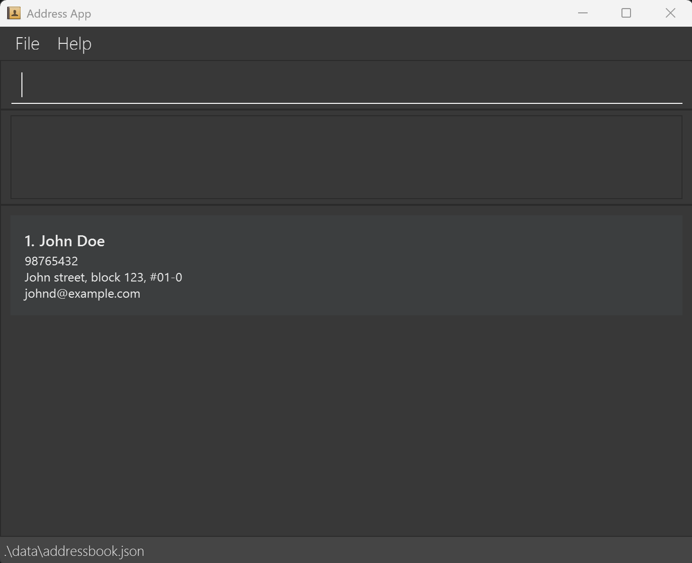
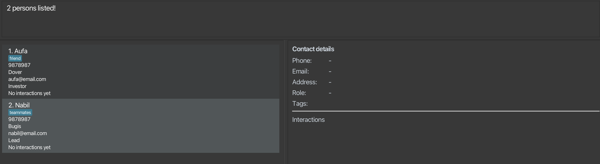

AddressBook Level 3 (AB3) is a **desktop app for managing contacts, optimized for use via a Command Line Interface** (CLI) while still having the benefits of a Graphical User Interface (GUI). If you can type fast, AB3 can get your contact management tasks done faster than traditional GUI apps.

* Table of Contents
  {:toc}

--------------------------------------------------------------------------------------------------------------------

## Quick start

1. Ensure you have Java `17` or above installed in your Computer. 
   **Mac users:** Ensure you have the precise JDK version prescribed [here](https://se-education.org/guides/tutorials/javaInstallationMac.html).

2. Download the latest `.jar` file from [here](https://github.com/se-edu/addressbook-level3/releases).

3. Copy the file to the folder you want to use as the _home folder_ for your AddressBook.

4. Open a command terminal, `cd` into the folder you put the jar file in, and use the `java -jar addressbook.jar` command to run the application. 
   A GUI similar to the below should appear in a few seconds. Note how the app contains some sample data. 
   

5. Type the command in the command box and press Enter to execute it. e.g. typing **`help`** and pressing Enter will open the help window. 
   Some example commands you can try:

    * `list` : Lists all contacts.
    * `add n/John Doe p/98765432 e/johnd@example.com a/John street, block 123, #01-01` : Adds a contact named `John Doe`.
    * `delete 3` : Deletes the 3rd contact shown in the current list.
    * `clear` : Deletes all contacts.
    * `exit` : Exits the app.

6. Refer to the [Features](#features) below for details of each command.

--------------------------------------------------------------------------------------------------------------------

## Features

**:information_source: Notes about the command format:** 

* Words in `UPPER_CASE` are the parameters to be supplied by the user. 
  e.g. in `add n/NAME`, `NAME` is a parameter which can be used as `add n/John Doe`.

* Items in square brackets are optional. 
  e.g `n/NAME [t/TAG]` can be used as `n/John Doe t/friend` or as `n/John Doe`.

* Items with `…`​ after them can be used multiple times including zero times. 
  e.g. `[t/TAG]…​` can be used as none (` `), `t/friend`, `t/friend t/family`, etc.

* Parameters can be in any order. 
  e.g. if the command specifies `n/NAME p/PHONE_NUMBER`, `p/PHONE_NUMBER n/NAME` is also acceptable.

* Extraneous parameters for commands that do not take in parameters (such as `help`, `list`, `exit` and `clear`) will be ignored. 
  e.g. if the command specifies `help 123`, it will be interpreted as `help`.

* If you are using a PDF version of this document, be careful when copying and pasting commands that span multiple lines, as space characters surrounding line breaks may be omitted when copied over to the application.

---

### Viewing help : `help`

Display a message showing how to access the help page.

**Format:** `help`

---

### Adding a person : `add`

Adds a person to the address book.

**Format:**
`add n/NAME p/PHONE_NUMBER e/EMAIL a/ADDRESS [t/TAG] r/ROLE [c/DAYS]`

:bulb: **Tip:**
A person can have any number of tags (including 0).

**Examples:**
* `add n/John Doe p/98765432 e/johnd@example.com a/John street, block 123, #01-01 r/Investor c/23`
* `add n/Betsy Crowe t/friend e/betsycrowe@example.com a/Newgate Prison p/1234567 t/criminal r/Customer c/20`

---

### Listing all persons : `list`

Shows a list of all persons in the address book.

**Format:** `list`

---

### Editing a person : `edit`

Edits an existing person in the address book.

**Format:**
`edit INDEX [n/NAME] [p/PHONE] [e/EMAIL] [a/ADDRESS] [t/TAG] [r/ROLE] [c/20]`

* Edits the person at the specified `INDEX` (must be a positive integer).
* At least one of the optional fields must be provided.
* Existing values will be updated to the input values.
* When editing tags, existing tags will be replaced with the new ones.
* To remove all tags, type `t/` without specifying any tags after it.

**Examples:**
* `edit 1 p/91234567 e/johndoe@example.com`
* `edit 2 n/Betsy Crower t/`

---

### Locating persons by name : `find`

Finds persons whose names contain any of the given keyword(s).

**Format:**
`find KEYWORD [MORE_KEYWORDS]`

* The search is case-insensitive.
* The order of the keywords does not matter.
* Partial matches are supported.
* Persons matching at least one keyword will be returned.

**Examples:**
* `find john`
* `find Nab Au`
  

**Details:**
* The search is case-insensitive (e.g., “john” matches “John”).
* Partial matches are supported (e.g., “Nab” matches “Nabil”).
* Multiple keywords will return all persons matching any of the keywords.

---

### Deleting a person : `delete`

Deletes the specified person from the address book.

**Format:**
`delete INDEX`

* Deletes the person at the specified `INDEX`.
* The index refers to the position shown in the displayed list.

**Examples:**
* `list` followed by `delete 2`
* `find Betsy` followed by `delete 1`

---

### Clearing all entries : `clear`

Clears all entries from the address book.

**Format:** `clear`

---

### Logging an interaction : `log`

Records an interaction for a contact. The latest one appears on the person’s card as `Last: <type · time>`.

**Format:**
`log INDEX i/<call|email|meeting|note> d/DETAILS`

**Example:**
`log 1 i/meeting d/Coffee chat`

**Notes:**
* Invalid index/type, empty details, or missing prefixes will trigger an error.
* Each person’s interactions are stored in the data file under an `interactions` array.
* Backward compatible with older data files (those without interactions).

---

### Exporting contact list : `export`

Exports the current or filtered contact list to a `.csv` file.

**Format:**
`export [FILENAME]`

**Details:**
* Saved to `data/exports/`.
* Automatically adds `.csv` if not provided.
* Prevents overwriting by adding numeric suffixes.
* Displays file path and number of contacts exported.

**Examples:**
* `export`
* `export my_contacts.csv`

---

### Command history

All commands made previously are stored, able to toggle to previous commands

**Format:**
Press <kbd>↑</kbd> and <kbd>↓</kbd> to navigate command history.

* Shown in chronological order (most recent last).
* Persists through different sessions
* Invalid commands are not recorded
* Navigate directly using keyboard:
    * <kbd>↑</kbd> — previous command
    * <kbd>↓</kbd> — next command
  
---

### Undoing latest command : `undo`

Undoes the most recent command made

**Format:**
`undo`
* Undo is recorded in the command history
* Undoing a command does not remove it from the command history

---

### Sorting persons by next follow-up date : `sortfollowup`

Sorts all persons in the address book by their next follow-up date.
Calculated from their last interaction date and cadence (in days).

**Format:** `sortfollowup`

This command helps you prioritise which contacts to reach out to next.  
* The next contact date = last interaction date + cadence days.
* Contacts with earlier next contact dates appear first.
* Contacts with no cadence and/or no recorded interactions appear last.
* Sorting affects only the displayed list — your data remains unchanged.
* Useful for tracking regular check-ins or follow-ups with clients.

**Expected output:** `Sorted all persons by next follow-up.`

:bulb: 
**Tip:** Use `sortfollowup` after logging new interactions to quickly see who you’ve recently contacted. 

---

### Exiting the program : `exit`

Exits the program.

**Format:** `exit`

---

### Saving the data

AddressBook data are saved automatically to the hard disk after every command that changes the data.

---

### Editing the data file

Data are stored as a JSON file: `[JAR file location]/data/addressbook.json`.

:exclamation: **Caution:**
If the file format becomes invalid, AddressBook will start with an empty data file on the next run. Always back up before editing manually.

---

### Archiving data files `[coming in v2.0]`

_Details coming soon..._

--------------------------------------------------------------------------------------------------------------------

## FAQ

**Q:** How do I transfer my data to another computer? 
**A:** Install the app on the new computer and replace its empty data file with the one from your old AddressBook home folder.

--------------------------------------------------------------------------------------------------------------------

## Known issues

1. **Multiple screens:** The GUI may open off-screen if the app was last closed on a secondary display. Delete `preferences.json` to reset window position.
2. **Minimized Help Window:** If minimized, re-running `help` will not open a new window. Restore the existing one manually.

--------------------------------------------------------------------------------------------------------------------

## Command summary

Action | Format, Examples
--------|------------------
**Add** | `add n/NAME p/PHONE_NUMBER e/EMAIL a/ADDRESS [t/TAG] r/ROLE [c/CADENCE]`  e.g., `add n/James Ho p/22224444 e/jamesho@example.com a/123, Clementi Rd t/friend r/customer c/20`
**Clear** | `clear`
**Delete** | `delete INDEX`  e.g., `delete 3`
**Edit** | `edit INDEX [n/NAME] [p/PHONE] [e/EMAIL] [a/ADDRESS] [t/TAG] [r/ROLE] [c/CADENCE]`  e.g., `edit 2 n/James Lee e/jameslee@example.com`
**Find** | `find KEYWORD [MORE_KEYWORDS]`  e.g., `find James Jake`
**List** | `list`
**Log** | `log INDEX i/<call|email|meeting|note> d/DETAILS`  e.g., `log 1 i/meeting d/Coffee chat`
**Export** | `export [FILENAME]`  e.g., `export contacts.csv`
**Help** | `help`
**Sort Follow Up** | `sortfollowup`
**Exit** | `exit`
